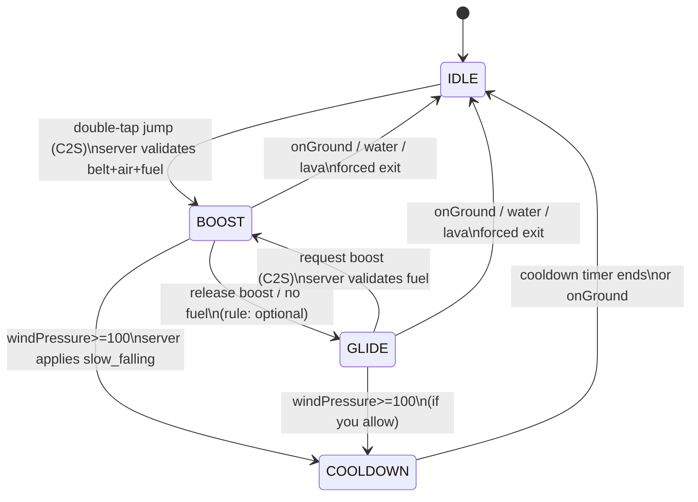
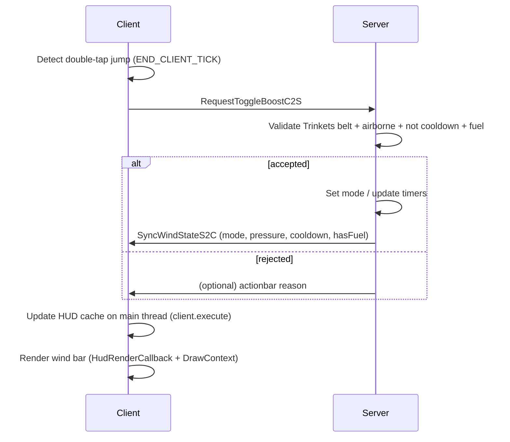
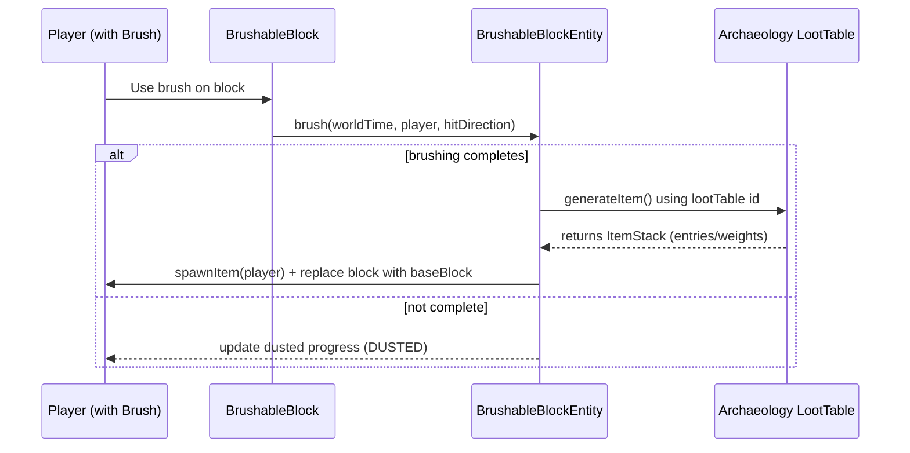

# Implementation Notes.md — 苍空遗闻 Echoes of the Sky（仅 Fabric 1.20.1）

## 执行摘要

本说明文档面向 **entity["video_game","Minecraft","java edition"] + entity["organization","Fabric","minecraft mod loader"] 的 **1.20.1** 版本，目标是把规格书中的 v0.1～v0.3 关键系统拆成「可直接交给程序员实现」的落地清单：  
A) 基于 **entity["organization","Trinkets","minecraft trinket api"]** 的腰带槽检测、客户端 HUD（风压条）、以及 Fabric 1.20.1 的 C2S/S2C 网络包最佳实践；B) 1.20.1 考古刷子系统：自定义 `BrushableBlock`（可疑云砂）+ archaeology loot table；C) v0.3 的结构世界生成：`structure` / `structure_set` / `biome tag` 绑定路线、数据包布局与常见坑。citeturn7view1turn8view0turn13search0turn37search2turn43view0turn43view1

关键落地原则（与规格书一致）：

- **服务器权威**：飞行状态切换与运动学在服务器执行，客户端只负责输入检测与 HUD 展示（防作弊/多人一致）；Fabric 1.20.1 推荐使用 Networking API 的 packet-object 形式（可读性更好、服务端回调更线程安全）。citeturn37search2turn13search7  
- **Trinkets 槽位数据驱动**：玩家默认没有槽位，必须通过 `data/trinkets/entities/*.json` 将所需槽位加入玩家；slot 的可装备物品由 `data/trinkets/tags/items/<group>/<slot>.json` 控制。citeturn8view0turn8view2turn8view3  
- **HUD 渲染与 1.20.x 兼容点**：1.20/1.20.1 渲染 API 改动引入 `DrawContext`，旧的 `DrawableHelper`/直接 GUI 绘制方式可能导致编译问题；HUD overlay 建议使用 `HudRenderCallback`（在 1.20.1 仍可用）。citeturn14view1turn0search14  
- **BrushableBlock 的核心约束**：自定义刷子考古方块要么复用 `BlockEntityType.BRUSHABLE_BLOCK`，要么解决 “block entity type 不支持你的方块” 的校验问题；`BlockEntityType#supports(BlockState)` 与内部 `blocks` 集合决定了它支持哪些方块。citeturn22view0turn26view0turn26view3turn23search0  
- **v0.3 的结构路线建议数据包优先**：结构数据由 `worldgen/structure` + `worldgen/structure_set` 定义；`structure.biomes` 可直接引用 biome tag；`structure_set.placement` 提供 `random_spread` 参数（salt/spacing/separation 等）。citeturn43view0turn43view1  

---

## Trinkets 腰带槽检测、客户端 HUD 与网络包

### 文件清单

> 约定 namespace 为 `wentest`（来自规格书）。Java 包名未指定；下文用 `<pkg>` 占位。

**资源/数据（必须）**

- `src/main/resources/data/trinkets/entities/wentest_player_slots.json`  
  - 用于把 `legs/belt` 槽加入 `player`（玩家默认无槽，见 Trinkets Data Formats）。citeturn8view0
- `src/main/resources/data/trinkets/tags/items/legs/belt.json`  
  - 把 `wentest:sky_belt` 加入 belt slot 的物品 tag（slot 默认只接受对应 tag 中物品）。citeturn8view2turn8view3

**代码（v0.1 MVP 建议最小集）**

- `src/main/java/<pkg>/WentestMod.java`（`ModInitializer`）
  - 注册物品、注册服务端网络包接收器、服务端 tick 更新器。citeturn37search1turn36search0
- `src/main/java/<pkg>/client/WentestClient.java`（`ClientModInitializer`）
  - 注册客户端输入检测（双击空格）、注册客户端网络包接收器、注册 HUD overlay。citeturn13search0turn36search1turn0search14
- `src/main/java/<pkg>/network/packet/RequestToggleBoostC2S.java`
- `src/main/java/<pkg>/network/packet/RequestDoubleJumpC2S.java`（v0.2，靴子二段跳）
- `src/main/java/<pkg>/network/packet/SyncWindStateS2C.java`
  - packet-object + `PacketType` 形式（Fabric API 1.20.1 networking）。citeturn38search1turn39search6turn37search2
- `src/main/java/<pkg>/server/flight/WindFlightState.java`（enum：IDLE/BOOST/GLIDE/COOLDOWN）
- `src/main/java/<pkg>/server/flight/WindFlightController.java`
  - 服务器 tick 驱动：风压、燃料、运动学、冷却计时。citeturn36search0
- `src/main/java/<pkg>/client/hud/WindHudOverlay.java`
  - `HudRenderCallback` 绘制风压条。citeturn0search14turn14view1
- `src/main/java/<pkg>/client/input/DoubleTapJumpDetector.java`
  - `ClientTickEvents.END_CLIENT_TICK` 中读取 jumpKey 状态并做双击判定。citeturn36search1
- `src/main/java/<pkg>/compat/TrinketsCompat.java`
  - 封装 `TrinketsApi.getTrinketComponent(player)` 与 `isEquipped` 检测。citeturn7view1turn7view2

### 关键字段与 JSON 示例（完整）

#### 玩家添加 belt 槽（Trinkets entity slots）

Trinkets 明确：entity slots 文件位于 `data/trinkets/entities/[id].json`，并且**玩家默认没有任何槽位**；需要通过该文件把槽位加到 `player`。citeturn8view0turn8view1

`data/trinkets/entities/wentest_player_slots.json`：

```json
{
  "entities": [
    "player"
  ],
  "slots": [
    "legs/belt"
  ]
}
```

其中 `legs/belt` 是 Trinkets 默认槽位之一（Trinkets 文档示例直接使用该 ID）。citeturn6view0turn8view1

#### 限定 sky_belt 只能装备在 belt 槽（Trinkets item tag）

Trinkets 文档指出：slot tags 存放在 `data/trinkets/tags/items/[group]/[slot].json`，并且 “By default, slots only accept items in the corresponding slot tag”。citeturn8view2turn8view3

`data/trinkets/tags/items/legs/belt.json`：

```json
{
  "replace": false,
  "values": [
    "wentest:sky_belt"
  ]
}
```

> 结论：只要 **sky_belt 不被加入其他槽的 tag**，`TrinketComponent.isEquipped(sky_belt)` 就等价于“佩戴在 belt 槽”。（严格 slot 校验可选，见下文“权限/防作弊”。）citeturn7view2turn8view3

### 关键 API / 类名（Fabric 1.20.1 & Trinkets）

#### Trinkets 检测核心

Trinkets API 给出最直接的入口：  
- `TrinketsApi.getTrinketComponent(LivingEntity)` → `Optional<TrinketComponent>`citeturn7view1  
- `TrinketComponent.isEquipped(Item)` / `isEquipped(Predicate<ItemStack>)`：判断某物品是否已佩戴citeturn7view2turn7view3  

> 建议在 `TrinketsCompat#hasSkyBelt(PlayerEntity)` 中封装成“**可运行的单行检查**”，并同时用于：飞行进入条件、HUD 显示条件、C2S 请求合法性验证。citeturn7view1turn7view2

#### Networking：1.20.1 推荐 packet-object API（C2S/S2C）

Fabric Networking API 在 1.20.1 仍支持 packet-object（`FabricPacket` + `PacketType`）：

- `FabricPacket`：packet 对象接口；官方建议 packet class 同时包含写入与读取构造（sender 构造 + `PacketByteBuf` 构造），避免读写顺序错位。citeturn39search6turn41search7  
- `PacketType.create(Identifier id, Function<PacketByteBuf,P> constructor)`：创建 packet type。citeturn38search1  
- `ServerPlayNetworking.registerGlobalReceiver(PacketType, PlayPacketHandler)`：服务端接收器（**线程安全更好**）；javadoc 明确 “newer method executes the callback in the server thread”。citeturn37search2turn13search7  
- `ClientPlayNetworking.registerGlobalReceiver(...)`：客户端接收器；javadoc 明确回调在 netty 线程，访问游戏状态必须 `client.execute(...)` 调度回主线程。citeturn13search0  

> 结论：**C2S 建议优先用 packet-object + ServerPlayNetworking 新式接收器**，避免在 netty 线程直接改世界；**S2C 客户端接收后必须调度到 render/main thread 再改 HUD 缓存**。citeturn37search2turn13search0turn13search7  

#### Tick、HUD 与输入（1.20.1）

- `ServerTickEvents.END_SERVER_TICK`：服务端每 tick 更新飞行状态机 / 风压 / 冷却。citeturn36search0turn36search7  
- `ClientTickEvents.END_CLIENT_TICK`：客户端每 tick 读取 jumpKey，做双击判定并发 C2S。citeturn36search1turn36search5  
- `HudRenderCallback`：HUD overlay 事件（1.20.1 可用）；1.20/1.20.1 渲染变更使用 `DrawContext`。citeturn0search14turn14view1  
- `KeyBindingHelper.registerKeyBinding(KeyBinding)`：若你决定提供“备用触发键”，使用 Fabric keybinding helper。citeturn1search1turn12view0  

### 实现步骤（按可直接施工的顺序）

#### 步骤：Trinkets 槽准备与 sky_belt 物品约束

1) 放入 `data/trinkets/entities/wentest_player_slots.json`，确保玩家有 `legs/belt` 槽。citeturn8view0turn8view1  
2) 放入 `data/trinkets/tags/items/legs/belt.json`，确保 `wentest:sky_belt` 可装备且只在 belt 槽生效。citeturn8view2turn8view3  
3) 代码侧实现 `TrinketsCompat.hasSkyBelt(player)`：内部用 `TrinketsApi.getTrinketComponent(player)` + `isEquipped(ModItems.SKY_BELT)`。citeturn7view1turn7view2  

#### 步骤：定义飞行状态与服务器权威状态机

建议在服务端维护以下字段（与规格书第 8 节一致，字段名可调整）：

- `mode: WindFlightState`（IDLE/BOOST/GLIDE/COOLDOWN）  
- `windPressure: int [0..100]`  
- `cooldownTicksRemaining: int`（COOLDOWN 计时）  
- `boostFuelTickCounter: int`（每 3 秒消耗 1 个 wind_crystal 的计数器，20t/s）  
- （v0.2）`bootDoubleJumpUsed` / `bootCooldownTicks`  

驱动点：`ServerTickEvents.END_SERVER_TICK` 遍历在线玩家，依据当前 `mode` 更新风压与冷却，并执行运动学（设置 velocity / fallDistance 等）。citeturn36search0turn36search7

> 结论：把“状态推进”（tick 更新）与“状态切换”（C2S 请求触发）拆开，有利于同步与调试；tick 驱动使用 Fabric 的 ServerTickEvents 属于标准事件入口。citeturn36search0

#### 步骤：网络包定义与注册（packet-object）

按规格书最小集：

- C2S：`request_toggle_boost`（双击触发）  
- C2S：`request_double_jump`（v0.2）  
- S2C：`sync_wind_state`（HUD 展示与客户端一致）

关键点：`PacketType.create(id, constructor)` 并让 packet 实现 `FabricPacket`。citeturn38search1turn39search6

示例：`SyncWindStateS2C` 建议字段（可扩展）：

- `int modeOrdinal`（或 byte）  
- `int windPressure`  
- `int cooldownTicksRemaining`  
- `boolean hasFuel`（可选；用于客户端提示“只能滑翔”）

服务端接收器注册：使用 `ServerPlayNetworking.registerGlobalReceiver(PacketType, handler)`（packet-object 新式 API），javadoc 明确该形式在 server thread 执行回调，线程安全更好。citeturn37search2turn13search7

客户端接收器注册：`ClientPlayNetworking.registerGlobalReceiver(...)`，然后在 handler 内 `client.execute(() -> updateHudCache(...))`，因为回调处于 netty 线程。citeturn13search0

#### 步骤：客户端双击空格检测与发包

推荐在 `ClientTickEvents.END_CLIENT_TICK` 中实现双击检测（不需要额外 KeyBinding；但可选提供“备用键”）。citeturn36search1turn1search1

双击判定建议逻辑（摘要）：

- 维护 `lastJumpPressTick`  
- 当本 tick 检测到 jumpKey **从未按下→按下** 的沿触发：
  - 若玩家 `!onGround`（客户端判断仅做体验优化；最终以服务端验证为准），且 `currentTick - lastJumpPressTick <= windowTicks`（例如 7~10），则触发飞行请求：发送 `RequestToggleBoostC2S`。  
  - 更新 `lastJumpPressTick = currentTick`。  

> 结论：客户端检测只负责“触发时机”，合法性必须服务器再次验证；这是你规格书“服务器权威”的直接落地。citeturn37search2turn13search7  

#### 步骤：服务端处理 request_toggle_boost（权限/防作弊）

服务端 handler 中必须验证（来自规格书 entering/exit 条件）：

- 必须佩戴 `wentest:sky_belt`（Trinkets 检测）。citeturn7view1turn7view2  
- 必须 `!player.isOnGround()`（仍在空中）。  
- 不在 COOLDOWN（`cooldownTicksRemaining == 0` or `mode != COOLDOWN`）。  
- 若请求进入 BOOST：检查燃料 `wind_crystal` 是否足够（背包任意位置扣除；实现细节未指定）。  
- 水/岩浆失效逻辑：未指定（可在服务端 tick 中检测 fluid state 并强制退出）。  

成功切换后立即发送一次 `SyncWindStateS2C` 给该玩家，以保证 HUD 立刻刷新（而不是等下一次周期同步）。Fabric Networking 支持服务端发送 clientbound packet（ServerPlayNetworking 提供“sending clientbound packets”的能力）。citeturn37search1turn37search2

### 数据同步策略（建议可直接用）

#### 同步频率与触发点

为了减少带宽与 HUD 抖动，建议：

- **事件驱动同步**：在以下事件立刻发 `sync_wind_state`  
  - mode 变化（IDLE↔BOOST↔GLIDE↔COOLDOWN）  
  - windPressure 到达阈值触发过热（进入 COOLDOWN）  
  - 燃料从“有→无/无→有”（影响 BOOST 可用性提示）
- **节流周期同步**：比如每 5 tick 或 10 tick 同步一次 windPressure（只给自己客户端即可，除非你要让其他玩家看到粒子/动画）。  

> 结论：Networking API 的回调线程属性决定你必须把“高频连续更新”尽可能留在本地缓存/插值里；服务端同步只提供权威值与纠偏。citeturn13search0turn37search2

#### 客户端 HUD 缓存结构（建议）

客户端维护一个简单 POJO/record：

- `WindFlightState mode`
- `int windPressure`
- `int cooldownTicksRemaining`
- `long lastSyncClientTick`

HUD 使用本地 tick 做插值/平滑（未指定；v0.1 可以不做）。

### HUD overlay（风压条）实现要点

- 使用 `HudRenderCallback` 注册 overlay（1.20.1 可用）。citeturn0search14  
- 在回调里使用 `DrawContext` 绘制（1.20/1.20.1 渲染接口变更点）。citeturn14view1  
- 显示条件：`hasSkyBelt && (mode != IDLE || cooldownTicksRemaining > 0)`（与你规格书第 9 节一致）。  
- 过热提示：服务端触发时可额外发一个 “actionbar 文本/音效” 的 S2C（具体 API 未指定；可选）。  

> 结论：如果你从旧教程复制 `DrawableHelper` 相关 HUD 代码，在 1.20.x 很容易遇到编译差异；Fabric 1.20/1.20.1 的改动提示直接点名 GUI 渲染迁移到 `DrawContext`。citeturn14view1

### Mermaid：飞行状态机与网络流





（客户端接收线程与调度要求见 ClientPlayNetworking javadoc；服务端 packet-object handler 线程安全说明见 ServerPlayNetworking javadoc。）citeturn13search0turn37search2turn13search7

### 常见坑位与调试方法（A）

| 症状 | 根因 | 解决方案 |
|---|---|---|
| 玩家无法装备 sky_belt / slot UI 不出现 | 玩家默认没有 Trinkets 槽；必须通过 `data/trinkets/entities/*.json` 加槽 | 确认 `entities:["player"]` + `slots:["legs/belt"]` 已加载；同时确认资源路径正确。citeturn8view0turn8view1 |
| 装备了 sky_belt 但 `hasSkyBelt` 返回 false | 没把物品加入 `data/trinkets/tags/items/legs/belt.json`，slot 默认只接收对应 tag 物品 | 加入 tag 并保持 `replace:false`。citeturn8view2turn8view3 |
| 客户端收到 S2C 后偶发崩溃 / 读写不同步 | 在 netty 线程直接读写游戏对象，或 packet 字段读写顺序不一致 | ClientPlayNetworking 回调中 `client.execute(...)`；packet 类遵循 FabricPacket 建议（字段+写入+buf 构造）。citeturn13search0turn41search7turn39search6 |
| 服务端偶发 “异步修改世界” 类问题 | 使用旧式 channel handler 在 netty 线程改世界 | 改用 ServerPlayNetworking packet-object API（回调在 server thread）；或在旧 API 中 `server.execute(...)` 调度。citeturn37search2turn37search9 |
| HUD 渲染代码编译不过（DrawableHelper 等） | 1.20/1.20.1 GUI 渲染迁移到 `DrawContext` | 仅在 1.20.1 使用 `DrawContext` 绘制；不要照搬旧版 `DrawableHelper` 代码。citeturn14view1turn0search14 |

---

## 考古刷子与可疑云砂

### 文件清单

**资源/数据（必须）**

- `src/main/resources/data/wentest/loot_tables/archaeology/suspicious_cloud_sand.json`
  - archaeology loot table（刷出 `wentest:gale_core_shard` 等）。
- （可选）`src/main/resources/data/wentest/loot_tables/blocks/suspicious_cloud_sand.json`
  - 方块被破坏时的掉落规则（未指定；v0.3 以后再精细化）。
- `src/main/resources/assets/wentest/blockstates/suspicious_cloud_sand.json`（方块状态）
- `src/main/resources/assets/wentest/models/block/suspicious_cloud_sand.json`
- `src/main/resources/assets/wentest/models/item/suspicious_cloud_sand.json`
- `src/main/resources/assets/wentest/lang/zh_cn.json`（或 `en_us.json`，未指定）

**代码（强烈建议）**

- `src/main/java/<pkg>/registry/ModBlocks.java`
  - 注册 `wentest:suspicious_cloud_sand`。
- `src/main/java/<pkg>/block/SuspiciousCloudSandBlock.java`
  - `extends BrushableBlock`（或直接实例化 `new BrushableBlock(...)`）。
- `src/main/java/<pkg>/mixin/BlockEntityTypeAccessor.java`
- `src/main/java/<pkg>/mixin/BrushableBlockEntityTypeMixin.java`（或在 ModInitializer 中用 accessor 修补）
  - 解决 BlockEntityType 对自定义 brushable block 的支持校验（关键坑）。citeturn26view0turn26view3turn23search0
- `src/main/resources/wentest.mixins.json`
  - 注册 mixin。

### 关键 API / 类名（1.20.1）

#### 方块与方块实体

- `net.minecraft.block.BrushableBlock`
  - 继承自 `BlockWithEntity`，并实现 `LandingBlock`；自带 `DUSTED` 属性与 `createBlockEntity(...)`等。citeturn17view0turn16view0  
  - 构造器：`BrushableBlock(Block baseBlock, Settings settings, SoundEvent brushingSound, SoundEvent brushingCompleteSound)`。citeturn17view2  
- `net.minecraft.block.entity.BrushableBlockEntity`
  - 字段包含 `lootTable` / `lootTableSeed` / `item` 等，并提供：  
    - `setLootTable(Identifier lootTable, long seed)`  
    - `toUpdatePacket()` / `toInitialChunkDataNbt()` 用于客户端可见状态同步  
    - `brush(...)` / `finishBrushing(...)` / `generateItem(...)` 生命周期方法。citeturn22view0  
- `net.minecraft.block.entity.BlockEntityType.BRUSHABLE_BLOCK`
  - 1.20.1 存在常量 `BRUSHABLE_BLOCK`。citeturn23search0  
- `net.minecraft.block.entity.BlockEntityType#supports(BlockState)`
  - 明确用于判断 type 是否支持某状态；内部与 block（而非 state）相关。citeturn26view0  
- `net.minecraft.block.entity.BlockEntityType` 内部字段 `private final Set<Block> blocks`
  - 即 “这个 block entity type 支持哪些 blocks” 的集合来源。citeturn26view3  

> 关键结论：**自定义 BrushableBlock 如果最终仍使用 `minecraft:brushable_block` 这个 block entity type（BrushableBlockEntity），你必须保证 `BlockEntityType.BRUSHABLE_BLOCK.supports(yourBlockState)==true`**；否则世界加载/放置时可能触发 “invalid block entity” 类错误。该结论来自 `supports` 方法与内部 `blocks` 集合定义。citeturn26view0turn26view3turn23search0

#### Loot table 结构（关键类名清单）

（以下为类名要求清单；具体 JSON 结构以 1.20.1 数据包 loot table 规范为准，细节未指定）

- `net.minecraft.loot.LootTable`
- `net.minecraft.loot.LootPool`
- `net.minecraft.loot.entry.LootItem`
- `net.minecraft.loot.condition.LootCondition`

### 实现步骤（B）

#### 步骤：定义 BrushableBlock（可疑云砂）

1) 注册方块 `wentest:suspicious_cloud_sand`，实现方式二选一：  
   - A. `new BrushableBlock(baseBlock, settings, brushingSound, brushingCompleteSound)`  
   - B. `class SuspiciousCloudSandBlock extends BrushableBlock { ... }`  

`BrushableBlock` 构造器签名是确定的（见 Yarn 1.20.1 javadoc），因此 v0.3 的自定义方块可以不改刷子交互逻辑，先复用原生流程。citeturn17view2turn17view0  

2) `baseBlock` 未指定：  
   - 若你希望“刷完变回某种云砂”，应先实现一个普通方块 `wentest:cloud_sand` 并在此处引用；  
   - MVP 可先用 `minecraft:sand` 作为 `baseBlock`（体验上刷完会变回沙子），后续再替换。  
（这是实现建议；规格书未指定 baseBlock/材质。）  

#### 步骤：确保 BrushableBlockEntityType 支持你的方块（关键坑处理）

由于 `BlockEntityType` 使用 `supports(BlockState)` 判断合法性，并且内部维护 `blocks` 集合（受支持 block 列表），你的自定义 brushable 方块如果不在该集合中，就会被判定“不支持”。citeturn26view0turn26view3  

**推荐方案（v0.3 最少侵入）：Mixin + 替换 blocks 集合**

- 做一个 accessor 把 `blocks` 暴露出来（并标记 `@Mutable` 允许替换），在 mod 初始化时把 `wentest:suspicious_cloud_sand` 合并进去。
- 为什么替换而不是 `add`：`blocks` 可能是不可变集合（具体实现未指定），直接 `add` 可能抛异常；替换成 `new HashSet<>(old)` 更稳。

> 结论：此修补之所以必要，是因为 `supports` 的语义与 `blocks` 字段在 Yarn 文档中被明确公开；它们共同决定了“是否支持自定义方块”。citeturn26view0turn26view3  

（如果你选择“完全自写 BrushableBlockEntity 并注册新 BlockEntityType”，需要重写原生刷子 reveal 粒子/同步逻辑，成本更高；本说明不建议在 v0.3 采用，且实现细节未指定。）

#### 步骤：写 archaeology loot table，并把 loot table 绑定到 BrushableBlockEntity

`BrushableBlockEntity` 明确提供 `setLootTable(Identifier lootTable, long seed)`，并且内部有 `LOOT_TABLE_NBT_KEY`、`ITEM_NBT_KEY` 等字段；因此把“刷出什么”数据化的核心就是：**在方块实体上写入 loot table id**。citeturn22view0  

绑定时机有三种（v0.3 建议优先第 2 种）：

1) **结构模板/世界生成写 NBT**（最贴近原版结构考古）  
   - 在结构 `.nbt` 中对该方块位置附带 block entity NBT：`LootTable` + `LootTableSeed`（键名以 `LOOT_TABLE_NBT_KEY` 为准；具体 NBT 格式未指定）。citeturn22view0  
2) **方块放置时（onPlaced）给默认 loot table**（开发与测试最方便）  
   - 在 `onPlaced`（server side）里取 `BrushableBlockEntity` 并 `setLootTable(wentest:archaeology/suspicious_cloud_sand, randomSeed)`。citeturn22view0  
3) **调试命令设置**（便于排查“为什么刷不出东西”）  
   - 自定义命令：对准方块后写入 loot table（实现方式未指定）。

### 关键字段/JSON 示例（完整）

#### archaeology loot table（建议）

> 注意：以下数值是**示例**，概率权重请按你规格书（“额外碎片概率”）微调；但“用 loot table 驱动掉落”与 `BrushableBlockEntity#setLootTable` 的关联是确定的。citeturn22view0

`data/wentest/loot_tables/archaeology/suspicious_cloud_sand.json`：

```json
{
  "type": "minecraft:archaeology",
  "pools": [
    {
      "rolls": 1,
      "entries": [
        { "type": "minecraft:item", "name": "wentest:gale_core_shard", "weight": 8 },
        { "type": "minecraft:item", "name": "minecraft:stick", "weight": 12 },
        { "type": "minecraft:item", "name": "wentest:wind_crystal", "weight": 3 },
        { "type": "minecraft:item", "name": "minecraft:emerald", "weight": 2 }
      ]
    }
  ]
}
```

> 若你希望“只额外掉碎片 + 其余掉空”，可以把 entries 第二项改为空权重（实现方式：loot table 空条目写法未指定；建议用工具生成并验证）。

### Mermaid：刷子考古生命周期（简化）



（`BrushableBlockEntity` 的 `brush / generateItem / setLootTable` 等方法在 Yarn 文档中明确可见。）citeturn22view0turn17view0  

### 常见坑位与解决方案（B）

- **坑：自定义可疑云砂放下就报错 / 读档报错**  
  - 根因：`BlockEntityType.BRUSHABLE_BLOCK.supports(state)` 为 false；该判断由 `supports` 方法与内部 `blocks` 集合控制。citeturn26view0turn26view3turn23search0  
  - 解决：用 mixin 方案把你的 block 纳入支持列表（见上文）。citeturn26view3  
- **坑：刷了半天什么都不掉**  
  - 根因：`BrushableBlockEntity` 没被写入 `lootTable`（字段存在且可为 null），`generateItem` 找不到表就不会产出。citeturn22view0  
  - 解决：在 onPlaced 设置默认 loot table；或在结构模板中写 block entity NBT；并在调试时打印该方块实体的 lootTable 是否为空（具体调试 API 未指定）。citeturn22view0  
- **坑：客户端显示的 dusted 阶段不同步**  
  - 根因：方块实体可见状态需要通过 `toUpdatePacket`/`toInitialChunkDataNbt` 同步；BrushableBlockEntity 提供这两个接口，但你若自写 BE 可能遗漏。citeturn22view0  
  - 解决：v0.3 尽量复用原生 `BrushableBlockEntity`，不要在 MVP 阶段重写同步。citeturn22view0  

---

## 世界生成与风啸神殿 v0.3 路线

### 文件清单

> v0.1 明确不做世界生成；v0.3 才进入正式生成。以下为 v0.3 的“可行最短路径”。

**worldgen JSON（必须）**

- `src/main/resources/data/wentest/worldgen/structure/wind_howl_temple.json`
- `src/main/resources/data/wentest/worldgen/structure_set/wind_howl_temple.json`

结构定义字段与 placement 字段规则分别对应 structure / structure_set 的数据包规范：  
- `structure` 根字段包含 `type`, `biomes`, `step`, `terrain_adaptation`, `spawn_overrides` 等；其中 `biomes` 可为 biome tag。citeturn43view0  
- `structure_set` 根字段包含 `structures` 与 `placement`，`placement.type` 可为 `minecraft:random_spread`，并配置 `salt/spacing/separation` 等。citeturn43view1  

**biome tag（推荐）**

- `src/main/resources/data/wentest/tags/worldgen/biome/has_structure/wind_howl_temple.json`
  - 结构 JSON 里引用该 tag：把“允许生成的生物群系集合”从结构定义中解耦出来（方便调试替换）。citeturn43view0turn44search3  

**jigsaw 结构池与模板（若采用 jigsaw）**

- `src/main/resources/data/wentest/worldgen/template_pool/wind_howl_temple/start_pool.json`
- `src/main/resources/data/wentest/worldgen/template_pool/wind_howl_temple/*.json`（多 pool，未指定）
- `src/main/resources/data/wentest/structures/wind_howl_temple/*.nbt`
  - 结构模板文件路径是 data pack 常见约定（具体内容制作流程未指定；通常用结构方块导出）。

**loot tables（建议）**

- `src/main/resources/data/wentest/loot_tables/chests/wind_howl_temple.json`（宝箱）
- 复用上一章 `archaeology/suspicious_cloud_sand.json`

### 关键 API / 类名（用于定位注册表与调试）

- `RegistryKeys.STRUCTURE` / `RegistryKeys.STRUCTURE_SET`：结构与结构集的注册表 key（用于代码侧引用或 debug）。citeturn34search9  
- `StructureSet`：结构集（Yarn 显示其在世界生成/placement 使用处出现）。citeturn34search3  
- （Trinkets/飞行系统本章不再重复）

### v0.3 实现步骤（数据包优先）

#### 步骤：biome tag 定义“可生成的群系集合”

规格书建议：山地/雪山/极端山地，具体 tag 调试后确定。这里给一个**可运行的起点**（你可以后续替换 values 列表）。

`data/wentest/tags/worldgen/biome/has_structure/wind_howl_temple.json`：

```json
{
  "replace": false,
  "values": [
    "minecraft:jagged_peaks",
    "minecraft:frozen_peaks",
    "minecraft:snowy_slopes",
    "minecraft:grove",
    "minecraft:meadow",
    "minecraft:stony_peaks"
  ]
}
```

> 结论：structure 定义允许 `biomes` 字段使用 biome tag，这使得“结构生成群系选择”可完全数据驱动并独立迭代。citeturn43view0turn44search3  

#### 步骤：structure 定义（jigsaw 方案，v0.3 推荐）

`structure` 的根字段与 jigsaw 额外字段在文档中列出：`type=jigsaw` 时必须提供 `start_pool/size/start_height/max_distance_from_center` 等；`step` 必须是指定枚举之一；`terrain_adaptation` 可选。citeturn43view0  

同时，社区示例（jigsaw 结构 JSON）展示了最小可用字段组合，包括 `start_height: { "absolute": 0 }` 与 `project_start_to_heightmap`。citeturn44search3  

结合你需求（Y>=150），可先用常量 start_height：

`data/wentest/worldgen/structure/wind_howl_temple.json`：

```json
{
  "type": "minecraft:jigsaw",
  "biomes": "#wentest:has_structure/wind_howl_temple",
  "step": "surface_structures",
  "terrain_adaptation": "beard_thin",
  "spawn_overrides": {},
  "start_pool": "wentest:wind_howl_temple/start_pool",
  "size": 3,
  "start_height": { "absolute": 150 },
  "project_start_to_heightmap": "WORLD_SURFACE_WG",
  "max_distance_from_center": 80,
  "use_expansion_hack": false
}
```

说明（与来源对齐）：

- `biomes` 可为 biome tag。citeturn43view0  
- `step` 取值来自固定列表（含 `surface_structures`）。citeturn43view0  
- `type=minecraft:jigsaw` 时存在 `start_pool/size/start_height/project_start_to_heightmap/max_distance_from_center/use_expansion_hack` 等字段。citeturn43view0turn44search3  

> 未指定：`max_distance_from_center`、`size` 的最终取值需要根据你的结构池复杂度调整；上面给的是“能跑起来”的默认量级。

#### 步骤：structure_set 定义（random_spread placement）

structure_set 的字段规范在文档中明确：`structures` 列表（structure + weight）与 `placement` 对象；`placement.type=minecraft:random_spread` 时必须提供 `spacing` 与 `separation`，并提供 `salt` 等。citeturn43view1  

`data/wentest/worldgen/structure_set/wind_howl_temple.json`：

```json
{
  "structures": [
    {
      "structure": "wentest:wind_howl_temple",
      "weight": 1
    }
  ],
  "placement": {
    "type": "minecraft:random_spread",
    "salt": 184764321,
    "spacing": 48,
    "separation": 16,
    "spread_type": "triangular"
  }
}
```

> 结论：`spacing/separation/salt` 的有效范围与约束（separation ≤ spacing）在 structure_set 规范中被明确列出；这也是你控制“稀有度”的主要旋钮。citeturn43view1  

#### 步骤：jigsaw template_pool 与结构模板

这一部分字段在本次来源中未展开（未指定）。最低限度你需要：

- `start_pool` 指向的 template_pool JSON 存在；  
- pool 内引用的结构模板（`.nbt`）文件存在；  
- 模板里放置宝箱/可疑云砂时，务必写入对应 block entity NBT（例如宝箱 loot table、BrushableBlockEntity loot table）。`BrushableBlockEntity` 的 NBT key 与 `setLootTable` 能力在 Yarn 文档中可见。citeturn22view0  

### Mermaid：worldgen 数据流（structure_set → structure → biome tag）

```mermaid
flowchart TD
  A[Biome Tag\n#wentest:has_structure/wind_howl_temple] --> B[Structure JSON\nworldgen/structure/wind_howl_temple]
  B --> C[Structure Set JSON\nworldgen/structure_set/wind_howl_temple]
  C --> D[Chunk Generator Placement\nrandom_spread]
  D --> E[Place Jigsaw Start Pool\nstart_pool -> template_pool]
  E --> F[Templates (.nbt)\nchests / suspicious blocks / rooms]
```

（`structure.biomes` 支持 tag；`structure_set` 定义 placement 的字段约束。citeturn43view0turn43view1）

### 常见坑位与兼容性注意（C）

- **结构不生成 / 只能 `/place` 生效**  
  - 常见原因：`structure_set` placement 参数过稀（spacing 太大）或 biome tag 未包含当前世界实际生成的 biomes。`biomes` 可为 tag，优先在调试期把 tag values 设为少量确定 biomes 验证。citeturn43view0turn43view1  
- **结构生成高度不对（落到海平面/地表）**  
  - jigsaw 结构的 `start_height` 与 `project_start_to_heightmap` 组合会影响最终落点；字段存在性与用途在结构规范与示例中可见。citeturn43view0turn44search3  
- **spacing/separation 配置无效或报错**  
  - `random_spread` 明确要求 `separation` 不大于 `spacing`，并给出二者范围；请按规范设置并在上线前用最小 spacing 做压力测试。citeturn43view1  
- **想用代码修改 biome 来“加结构”**  
  - Fabric 1.20.1 的 `BiomeModifications`/`BiomeModificationContext.GenerationSettingsContext` 公开的主要是 feature/carver/spawn 的修改接口，并未在该 API 层直接提供结构注入入口（你不应依赖不存在的 `addStructure`）。citeturn29view0turn32view0  
  - 结论：v0.3 优先走数据包 `structure`/`structure_set` 路线；代码介入仅用于 debug/命令。citeturn43view0turn43view1  

---

## 通用调试与常见坑位速查

### 调试建议（可立即执行）

- **网络包调试**：  
  - 在 C2S handler 打印：玩家 UUID、请求时间、服务端判定结果（缺腰带/在地面/冷却中/无燃料等）。  
  - 若你误用旧式 channel handler，牢记其 `receive(...)` 在 netty event loop 线程执行，修改世界要调度到 server thread。citeturn37search9turn37search2  
- **客户端线程调试**：  
  - S2C handler 里只更新“HUD 缓存对象”，并用 `client.execute(...)`；ClientPlayNetworking 文档明确禁止在 handler 线程直接碰游戏状态。citeturn13search0  
- **v1.20.1→更高版本迁移风险提示（仅供未来）**：  
  - Fabric 1.20.5 起 networking 发生较大变更（PacketByteBuf API 移除、转向 vanilla `CustomPayload`/`PacketCodec`）；如果你未来升级，需整体改包系统。citeturn38search14  

### 选型对比：Networking 写法

| 方案 | 适用版本 | 优点 | 风险/坑 |
|---|---|---|---|
| packet-object（`FabricPacket` + `PacketType` + `registerGlobalReceiver(PacketType, ...)`） | Fabric 1.20.1 | 服务端回调线程更安全、读写聚合在一个类（降低顺序错位），官方更推荐 | 客户端接收依旧要调度回主线程；要为每个包建 class。citeturn37search2turn13search0turn38search1turn41search7 |
| 旧式 Identifier + `PacketByteBuf` channel handler | Fabric 1.20.1 | 写起来短、教程多 | 回调在 netty 线程，易踩“异步改世界”；读写顺序错位更常见。citeturn37search9turn13search0 |

### 选型对比：自定义 BrushableBlock 的 block entity 支持处理

| 方案 | 复杂度 | 是否推荐 v0.3 | 说明 |
|---|---|---|---|
| Mixin 修补 `BlockEntityType.BRUSHABLE_BLOCK` 支持集合 | 中 | 推荐 | 直接对齐 `supports` + `blocks` 的机制，能复用原生 `BrushableBlockEntity` 全套同步与刷子逻辑。citeturn26view0turn26view3turn22view0turn23search0 |
| 自写 block entity + 新 BlockEntityType | 高 | 不推荐 | 需要复刻刷子 reveal/同步/NBT，且容易与未来版本差异产生额外维护成本（细节未指定）。citeturn22view0 |

（以上对比均严格基于 1.20.1 的类与文档可见行为：`supports`/`blocks`、`setLootTable`、networking 回调线程等。）citeturn26view0turn26view3turn22view0turn37search2turn13search0